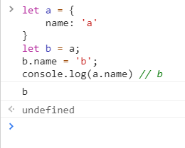
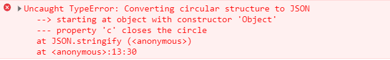
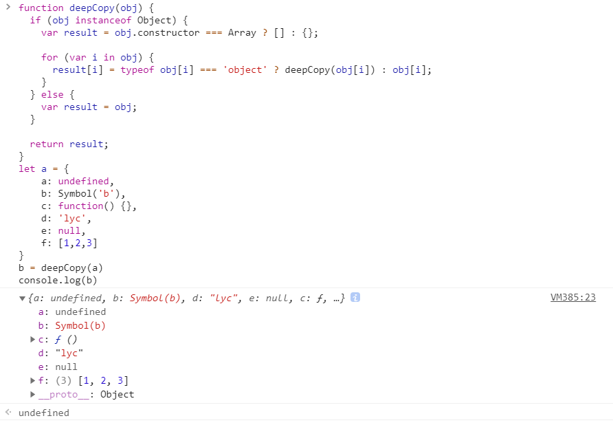

<!-- ::: tip
This is a tip
::: -->

<!-- more -->

## 什么是深浅拷贝？
先走一波代码
``` js
let a = {
    name: 'a'
}
let b = a
b.name = 'b'
console.log(a.name) // b
```



在控制台输入上面的代码，可以发现打印出来的a.name是b。

从上面的例子中我们可以发现，如果给一个变量赋值一个对象，那么两者的值会是同一个引用，其中一方改变，另一方也会相应改变，这显然不是我们想要的结果。
在开发中，我们希望a与b是独立开的，这时候我们可以用浅拷贝来初步解决这个问题。

## 浅拷贝
首先我们可以用Object.assign()来解决上面的例子的问题。
::: tip
### Object.assign()是啥？
Object.assign() 方法用于将所有可枚举属性的值从一个或多个源对象复制到目标对象。它将返回目标对象。
Object.assign(target, ...sources)    【target：目标对象】，【souce：源对象（可多个）】

举个栗子：
```js
const object1 = {
  a: 1,
  b: 2,
  c: 3
};

const object2 = Object.assign({c: 4, d: 5}, object1)

console.log(object2.c, object2.d)  //3 5
console.log(object1)  // { a: 1, b: 2, c: 3 }
console.log(object2)  // { c: 3, d: 5, a: 1, b: 2 }
```
:::

::: warning
### 注意：

1.如果目标对象中的属性具有相同的键，则属性将被源对象中的属性覆盖。后面的源对象的属性将类似地覆盖前面的源对象的属性。

2.Object.assign 方法只会拷贝源对象自身的并且可枚举的属性到目标对象。该方法使用源对象的[[Get]]和目标
对象的[[Set]]，所以它会调用相关 getter 和 setter。因此，它分配属性，而不仅仅是复制或定义新的属性。如
果合并源包含getter，这可能使其不适合将新属性合并到原型中。为了将属性定义（包括其可枚举性）复制到
原型，应使用Object.getOwnPropertyDescriptor()和Object.defineProperty() 。
:::

现在用```Object.assign()```来解决刚刚那个问题
```js
let a = {
    name: 'a'
}
let b = Object.assign({}, a)
b.name = 'b'
console.log(a.name) // a
```
另外，我们也可以通过ES6的展开运算符(...)来解决这个问题
```js
let a = {
    name: 'a'
}
let b = {...a}
b.name = 'b'
console.log(a.name) // a
```
一般来说浅拷贝能解决大部分的问题，但是遇到下面这种情况，浅拷贝就不得劲了
```js
let a = {
    name: 'a',
    days: {
        one: 'aDay'
    }
}
let b = {...a}
b.days.one = 'bDay'
console.log(a.days.one) // bDay
```
所以说浅拷贝解决的只是第一层的问题，如果对象中的值还有对象，就又回到了刚刚开始的那个问题了（搁这玩俄罗斯套娃呢），两者共享相同的引用。
要彻底解决这个拷贝的问题就需要引入深拷贝了。

## 深拷贝
深拷贝的一种办法就是把对象转成字符串再转成对象，就是``` JSON.parse(JSON.stringify(object)) ```
```js
let a = {
    name: 'a',
    days: {
        one: 'aDay'
    }
}
let b = JSON.parse(JSON.stringify(a))
b.days.one = 'bDay'
console.log(a.days.one) // aDay
```
但是这种方法有一定的局限性：
* 会忽略```undefined```
* 会忽略```symbol```
* 不能正常复制函数
* 不能解决循环引用的对象

什么是不能解决循环引用的对象，举个栗子
```js
let obj = {
  a: 1,
  b: {
    c: 2,
    d: 3,
  },
}
obj.c = obj.b
obj.e = obj.a
obj.b.c = obj.c
obj.b.d = obj.b
obj.b.e = obj.b.c
let newObj = JSON.parse(JSON.stringify(obj))
console.log(newObj)
```
发现控制台报错了！



在遇到函数、 undefined 或者 symbol 的时候，也不能正常复制，举个栗子

```js
let a = {
    a: undefined,
    b: Symbol('b'),
    c: function() {},
    d: 'lyc'
}
let b = JSON.parse(JSON.stringify(a))
console.log(b) // {d: 'lyc'}
```

## 遍历对象实现深拷贝
讲这么多，有没有可以复制函数、 undefined 或者 symbol 的深拷贝方法？

那必须有，上代码！

```js
function deepCopy(obj) {
  if (obj instanceof Object) {
    var result = obj.constructor === Array ? [] : {};
    
    for (var i in obj) {
      result[i] = typeof obj[i] === 'object' ? deepCopy(obj[i]) : obj[i];
    }
  } else {
    var result = obj;
  }
  
  return result;
}
```


问题得以解决！
